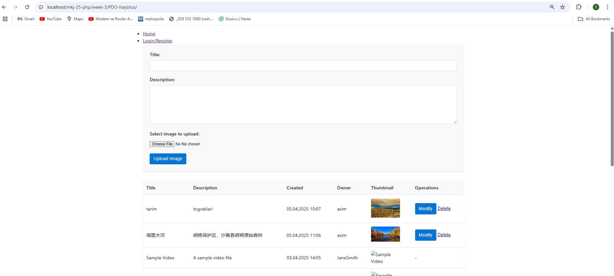
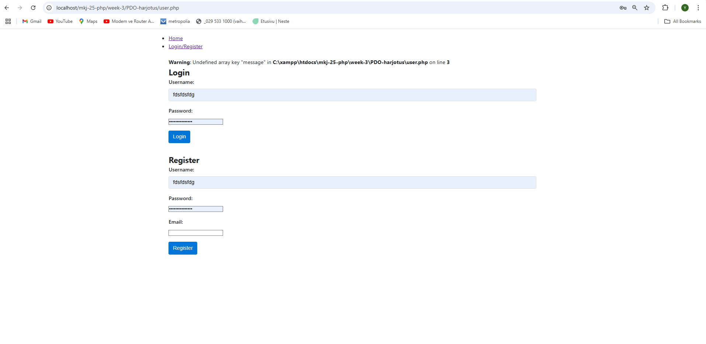
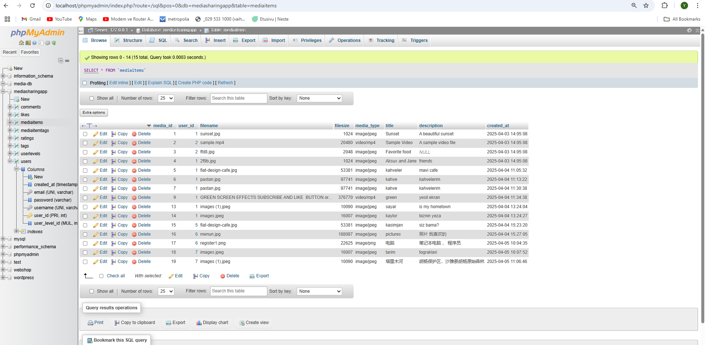

# Media Management System with PHP PDO





A secure media management system built with PHP PDO that allows users to upload, manage, and display media items (images and videos).

## Features

- 🖼️ Media upload (images and videos)
- 📋 Media listing with pagination
- ✏️ Edit media metadata
- 🗑️ Delete media items
- 🔒 Secure file upload handling
- 📱 Responsive design

## Installation

### Requirements

- PHP 7.4 or higher
- MySQL 5.7+ or MariaDB
- Web server (Apache/Nginx)
- Composer (recommended)

### Setup Instructions

1. **Database Setup**:
   ```sql
   CREATE DATABASE media_db;
   USE media_db;
   
   CREATE TABLE Users (
       user_id INT AUTO_INCREMENT PRIMARY KEY,
       username VARCHAR(50) NOT NULL UNIQUE,
       password VARCHAR(255) NOT NULL,
       created_at TIMESTAMP DEFAULT CURRENT_TIMESTAMP
   );
   
   CREATE TABLE MediaItems (
       media_id INT AUTO_INCREMENT PRIMARY KEY,
       user_id INT NOT NULL,
       filename VARCHAR(255) NOT NULL,
       filesize INT NOT NULL,
       media_type VARCHAR(50) NOT NULL,
       title VARCHAR(100) NOT NULL,
       description TEXT,
       created_at TIMESTAMP DEFAULT CURRENT_TIMESTAMP,
       FOREIGN KEY (user_id) REFERENCES Users(user_id)
   );
   
   -- Sample admin user (password: admin123)
   INSERT INTO Users (username, password) 
   VALUES ('admin', '$2y$10$92IXUNpkjO0rOQ5byMi.Ye4oKoEa3Ro9llC/.og/at2.uheWG/igi');